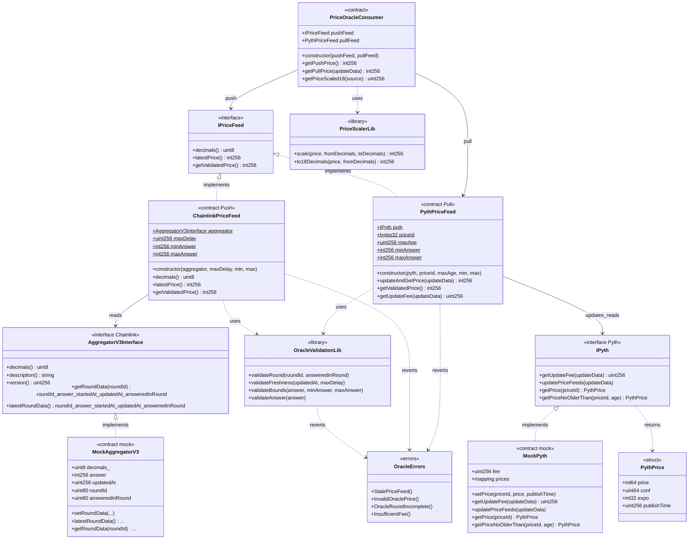

# Diagrama de clases — Decentralized Oracles (Push / Pull)

Vista estructural de contratos, interfaces y relaciones (módulo 13, **planificación v1**).

## Diagrama (Mermaid)

## Relaciones clave

| Relación | Motivo |
|----------|--------|
| `ChainlinkPriceFeed` → `AggregatorV3Interface` | Patrón Push: el feed ya está on-chain |
| `PythPriceFeed` → `IPyth` | Patrón Pull: el caller trae el payload y paga fee |
| Ambos → `OracleValidationLib` | Misma política de staleness / bounds / answer |
| `PriceOracleConsumer` → feeds | Fachada para protocolos que no quieren acoplarse al vendor |
| Mocks implementan interfaces reales | Unit tests sin RPC; fork tests usan contratos mainnet |

## Notas de diseño

- `IPriceFeed` unifica lectura; en Pull, la actualización puede ir en `updateAndGetPrice(bytes[])` (payable).
- Bounds y `maxDelay`/`maxAge` como `immutable` o configurables con `Ownable2Step` (decidir en Fase 3–4).
- Escalado a 18 decimales ocurre en el consumer o vía `PriceScalerLib`, no dentro del mock.
