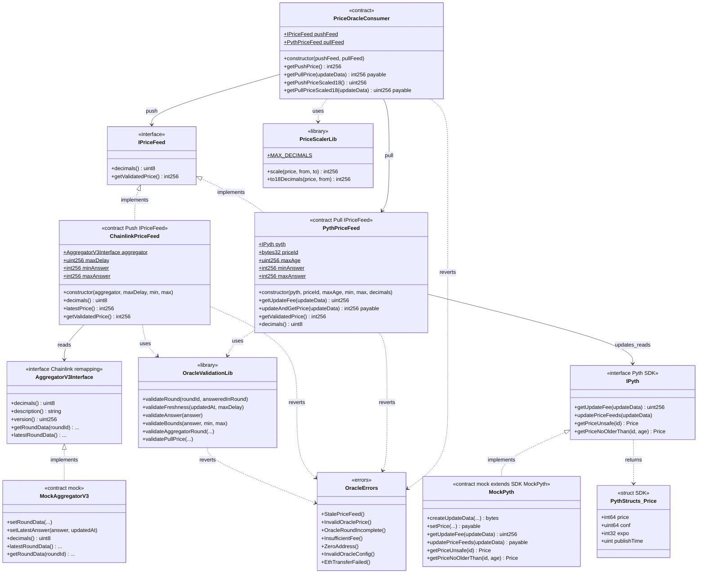

# Diagrama de clases — Decentralized Oracles (Push / Pull)

Vista estructural de contratos, interfaces y relaciones (módulo 13, **v1 final**).

## Diagrama (Mermaid)

## Relaciones clave

| Relación | Motivo |
|----------|--------|
| `ChainlinkPriceFeed` → `AggregatorV3Interface` | Patrón Push: el feed ya está on-chain |
| `PythPriceFeed` → `IPyth` | Patrón Pull: el caller trae el payload y paga fee |
| Ambos → `OracleValidationLib` | Misma política de staleness / bounds / answer |
| `PriceOracleConsumer` → feeds | Fachada; Push view + Pull payable con fee exacto y refund al caller |
| `MockPyth` hereda SDK | `IPyth` completo; helpers `createUpdateData` / `setPrice` |
| Remappings | Chainlink vía `lib/`; Pyth vía `node_modules/@pythnetwork/...` |

## Decisiones de diseño (v1)

- `IPriceFeed` solo `decimals` + `getValidatedPrice`; `latestPrice()` es alias en `ChainlinkPriceFeed`.
- Bounds, `maxDelay` / `maxAge`, addresses: **immutable** (retune = redeploy).
- Escalado a 18 decimals solo en el consumer (`getPushPriceScaled18` / `getPullPriceScaled18`).
- Consumer paga **fee exacto** a `PythPriceFeed` y refunde el exceso al `msg.sender` original.
