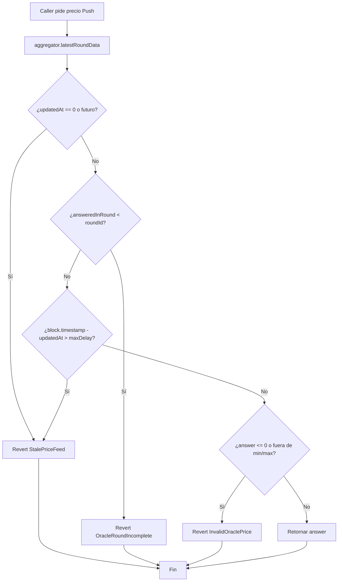
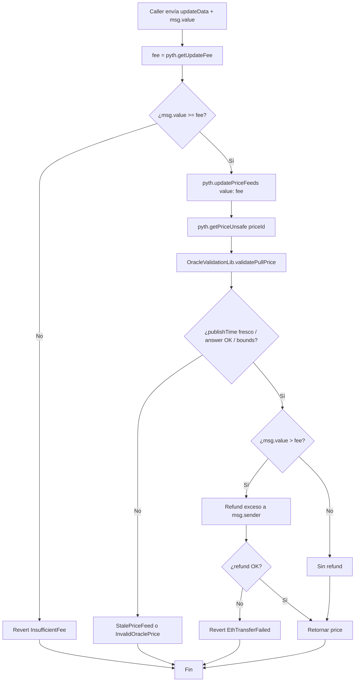
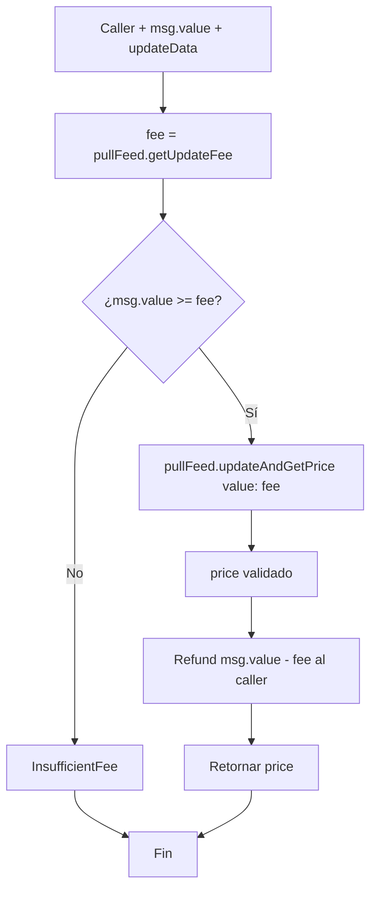
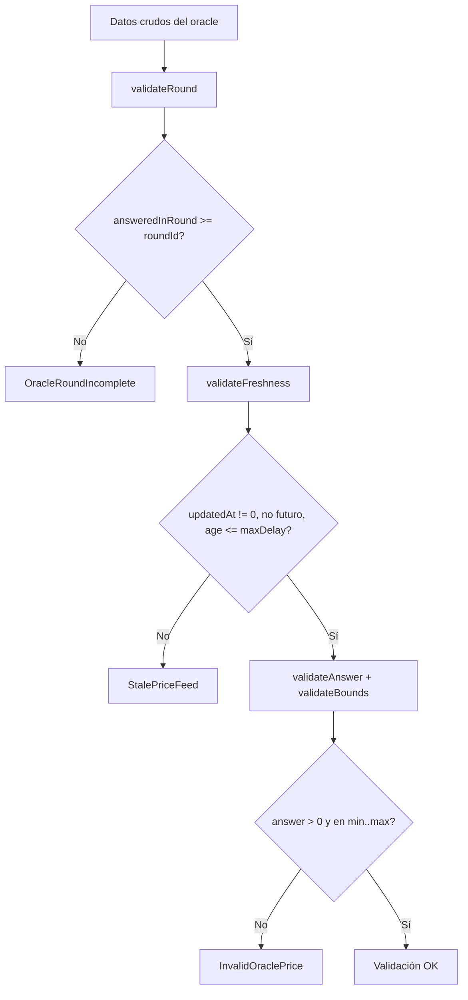
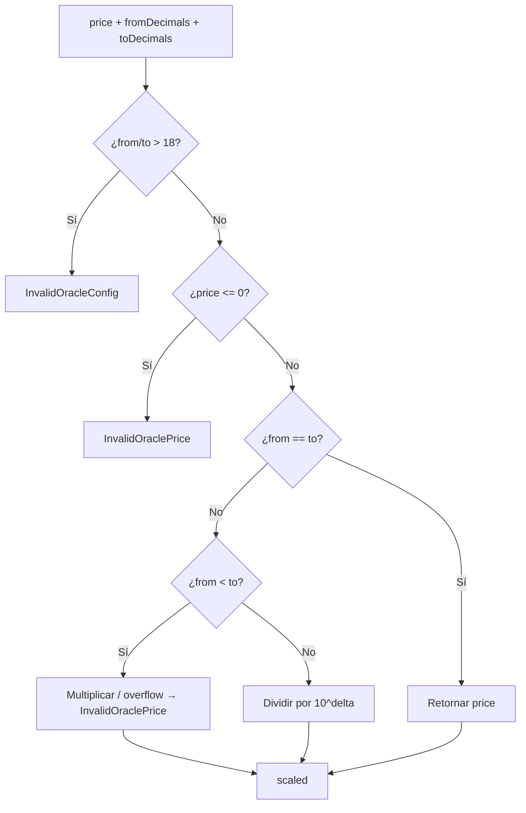
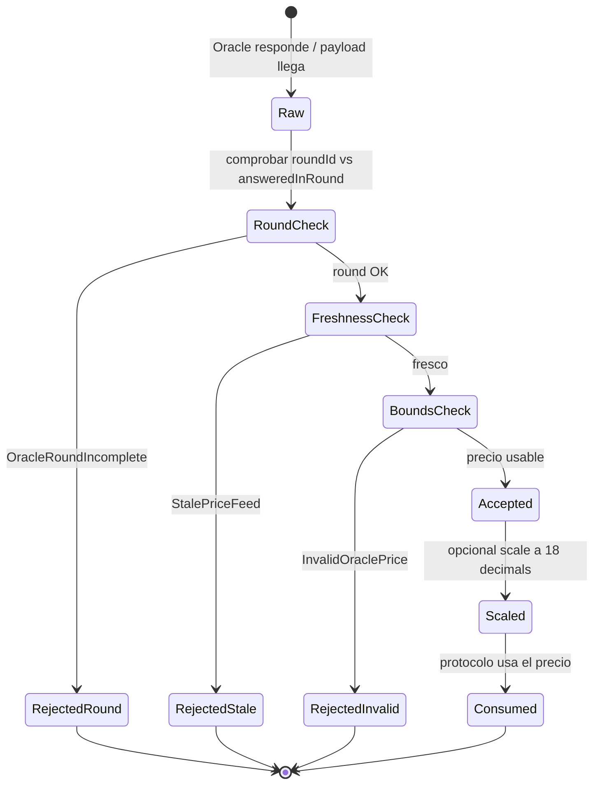
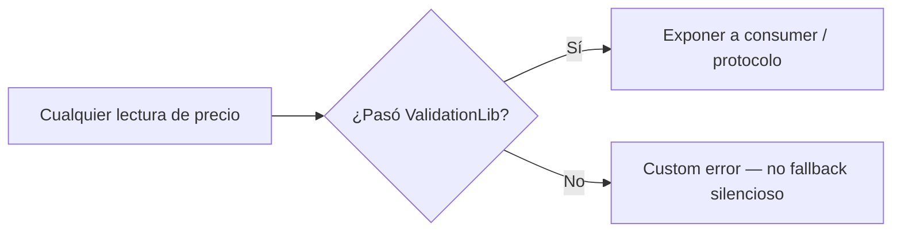

# Diagrama de flujo — Validación Push / Pull y consumo de precio

Flujos de decisión internos del sistema de oráculos (módulo 13, **v1 final**).

## 1. Lectura Push — `ChainlinkPriceFeed.getValidatedPrice`

## 2. Lectura Pull — `PythPriceFeed.updateAndGetPrice`

## 3. Consumer Pull — `PriceOracleConsumer.getPullPrice`

> El consumer envía **fee exacto** al feed (el feed no hace refund en ese path) y refunde el sobrante al usuario.

## 4. Validación compartida — `OracleValidationLib`

## 5. Escalado de decimales — `PriceScalerLib`

## 6. Ciclo de estados — precio observado

## 7. Regla transversal — nunca confiar en precio crudo

Aplica a: Push `latestRoundData`, Pull post-`updatePriceFeeds`, y helpers del consumer.
