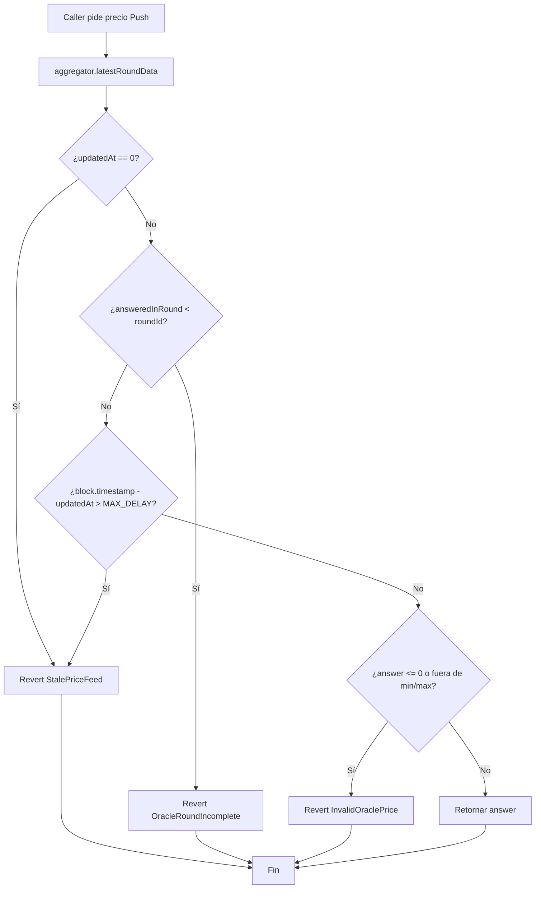
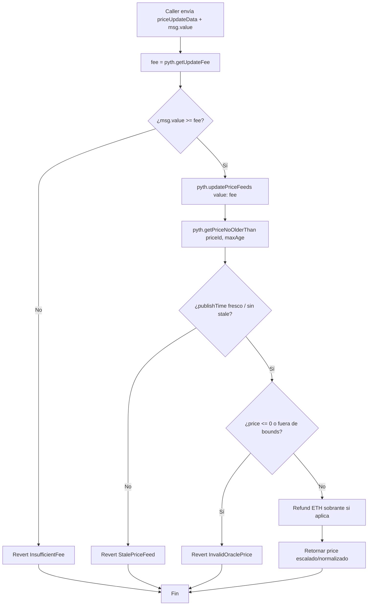
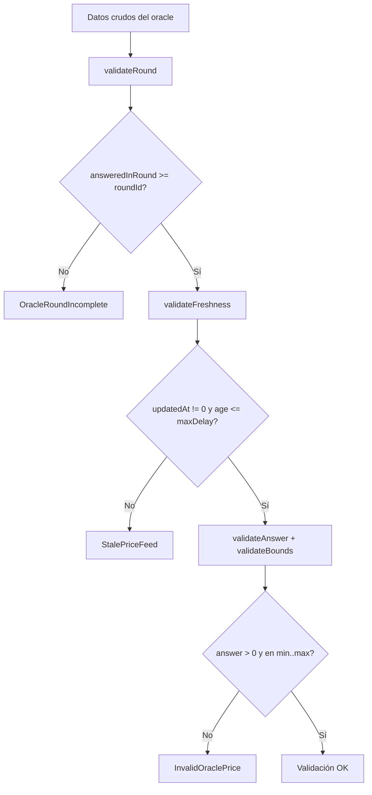
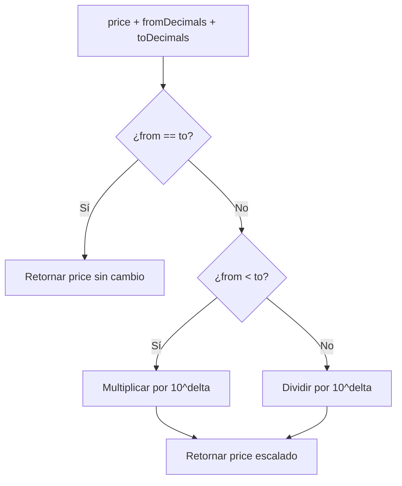
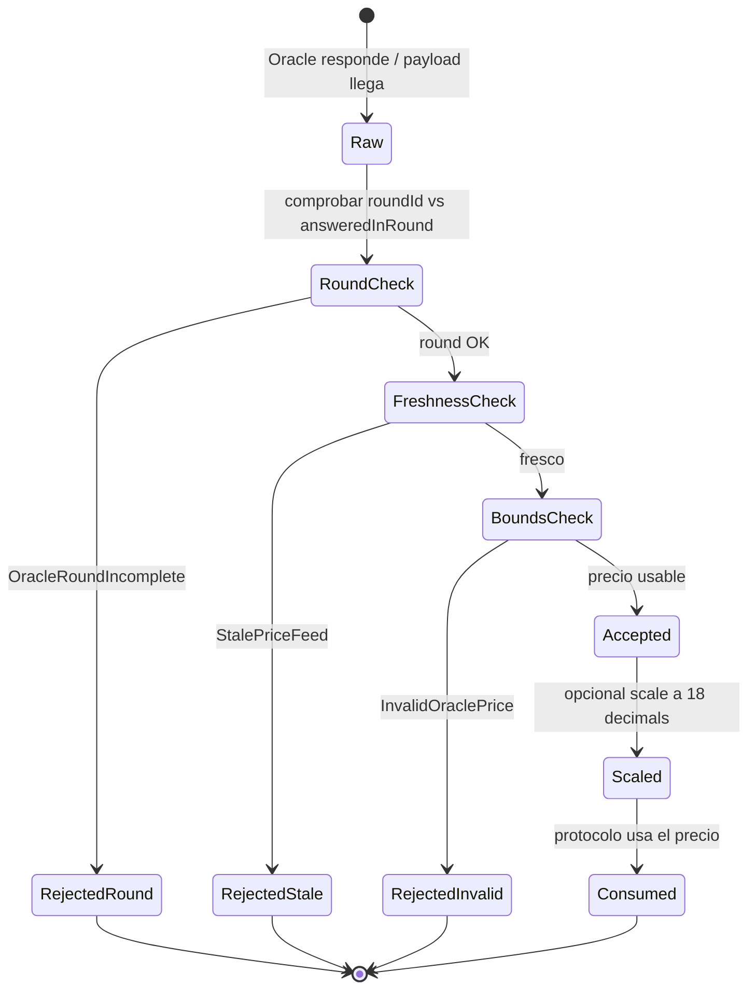
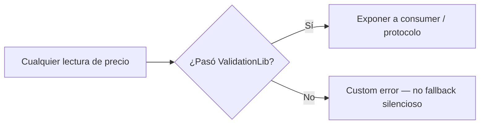

# Diagrama de flujo — Validación Push / Pull y consumo de precio

Flujos de decisión internos del sistema de oráculos (módulo 13, **planificación v1**).

## 1. Lectura Push — `ChainlinkPriceFeed.getValidatedPrice`

## 2. Lectura Pull — `PythPriceFeed.updateAndGetPrice`

## 3. Validación compartida — `OracleValidationLib`

## 4. Escalado de decimales — `PriceScalerLib`

## 5. Ciclo de estados — precio observado

## 6. Regla transversal — nunca confiar en precio crudo

Aplica a: Push `latestRoundData`, Pull post-`updatePriceFeeds`, y cualquier helper del consumer.
