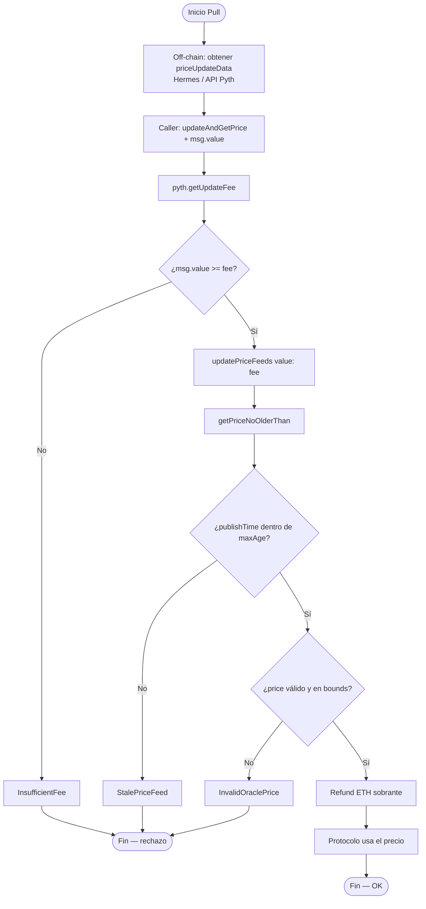
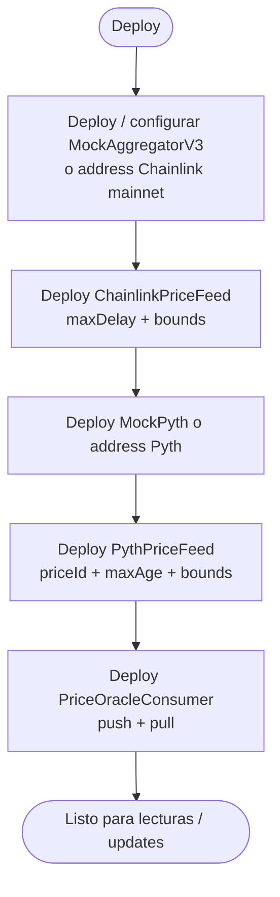
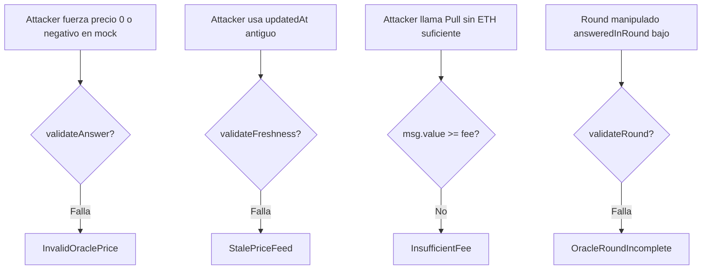
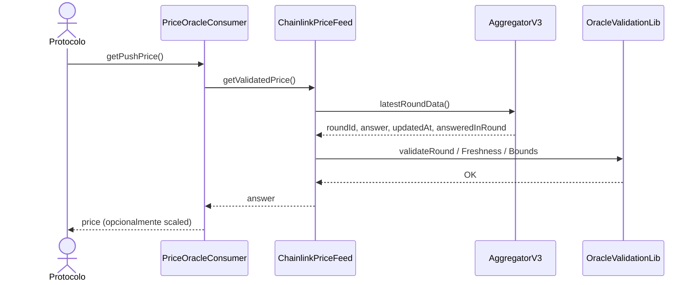
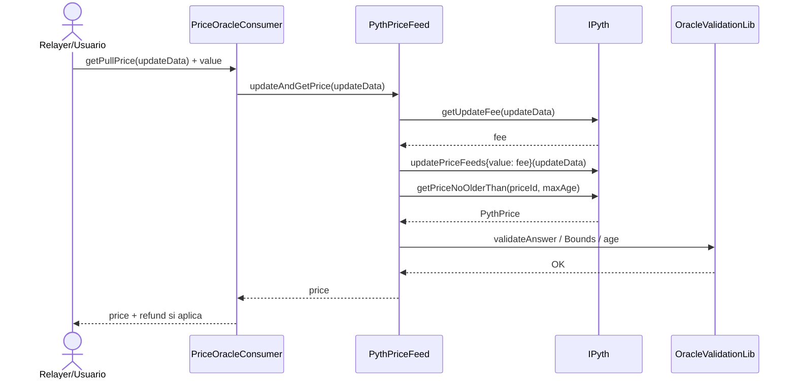
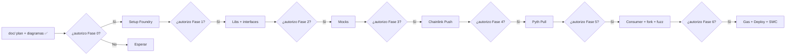

# Flujograma — Ciclo completo Push (Chainlink) y Pull (Pyth)

Flujo extremo a extremo entre actores y contratos (módulo 13, **planificación v1**): lectura Push, actualización Pull, validación y consumo.

## Actores

| Actor | Rol |
|-------|-----|
| Protocolo / Consumer | Solicita un precio seguro (Push o Pull) |
| Keeper / Relayer | En Chainlink mantiene el aggregator; en Pyth aporta `priceUpdateData` |
| Usuario / Tester | En tests: arma mocks o corre fork mainnet |
| AggregatorV3 (Chainlink) | Almacena rounds on-chain (modelo Push) |
| Pyth | Verifica attestations y actualiza precios on-demand (modelo Pull) |
| PriceOracleConsumer | Fachada unificada hacia el protocolo |
| CI / Foundry | Unit, fork, fuzz, gas |

---

## Flujograma principal — Push (Chainlink)

---

## Flujograma principal — Pull (Pyth)

---

## Flujograma — Deploy y wiring

---

## Flujograma — Ataques / misuse típicos

---

## Secuencia — camino feliz Push

---

## Secuencia — camino feliz Pull

---

## Gobernanza de implementación (autorización)

Sin frase de autorización explícita, **no se avanza** a la siguiente fase.
